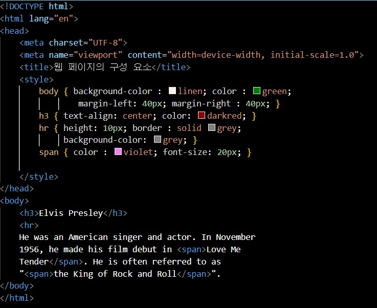

## 문제 풀이

# Open Challenge

자기 소개 HTML 페이지 만들기

# 실습문제 1번

오류 수정하기

span{ color = blue; font-size: 20px; } 부분에서 color 다음에 "="로 표기되어 오류가 발생했다.

그래서 "="을 ":" 고쳐 오류를 해결했다.

# 실습문제 2번

오류 수정하기

h3{ text-align : center color : darkred; } 부분에서 center 다음에 ";"를 표기하지 않아 오류가 발생했다.

그래서 ";" 표기해서 오류를 해결했다.

# 실습문제 3번

html 수정하기

 span 태그에 있는 color : blue를 violet으로 수정하고 hr 태그에 있는 height: 5px를 10px으로 수정한다.

color : blue;를 color : violet; 으로 height: 5px;를 height: 10px;으로 수정했다.

# 실습문제 4번

