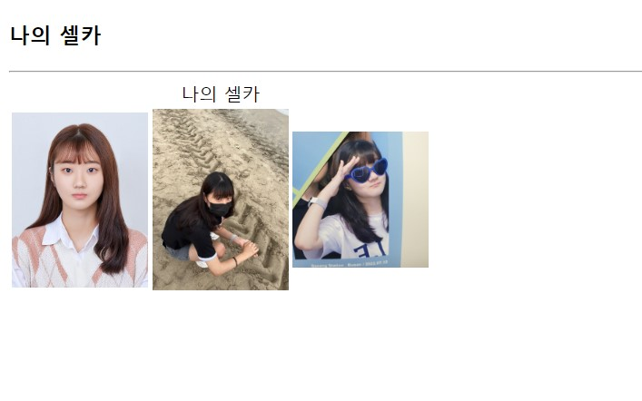

## 문제 풀이

# Open Challenge
<h2>HTML 태그로 웹 페이지 만들기</h2>

# 실습문제 1번
<h2>HTML5 페이지 작성하기</h2>

코드

웹 페이지

# 실습문제 2.(1)번
<h2>리스트를 가진 HTML5 페이지 작성하기</h2>

코드

웹 페이지

# 실습문제 2.(2)번
<h2>리스트를 가진 HTML5 페이지 작성하기</h2>

코드

웹 페이지

# 실습문제 3번
<h2>셀카 사진 HTML5 페이지 작성하기</h2>

코드

웹 페이지

# 실습문제 4.(1)번
<h2>표 HTML5 페이지 작성하기</h2>

코드

웹 페이지

# 실습문제 4.(2)번
<h2>표 HTML5 페이지 작성하기</h2>

코드

웹 페이지

# 실습문제 5번
<h2>참조 웹 페이지 작성하기</h2>

코드

웹 페이지

각각 누르면 새 창으로 사이트가 출력되는 것을 볼 수 있다.

# 실습문제 6번
<h2>애국가 오디오 웹 페이지 작성하기</h2>

코드

웹 페이지

