## 문제 풀이

# Open Challenge
<h2>구조화 및 웹 폼 삽입</h2>
Chapter 02에서 HTML 태그로 웹 페이지 만들기를 구조화하여 수정한 것이다.
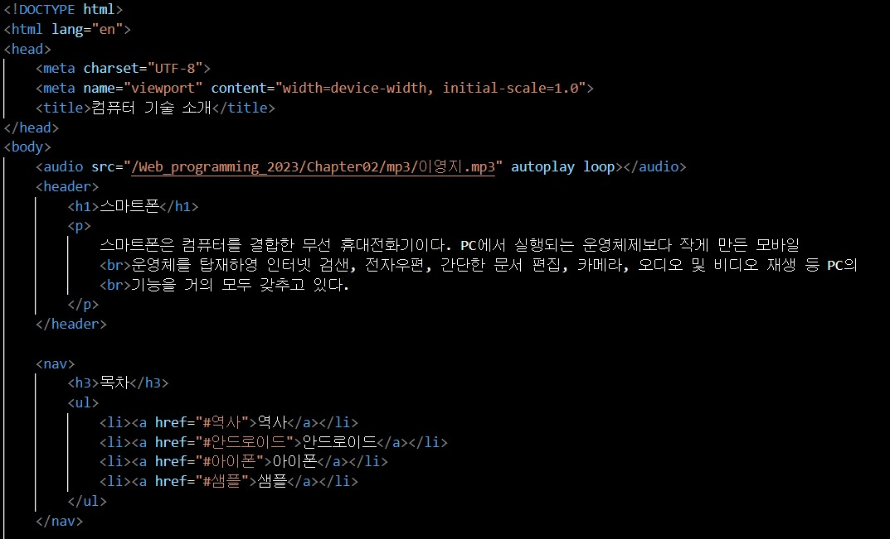
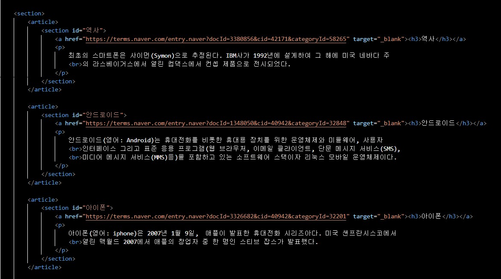
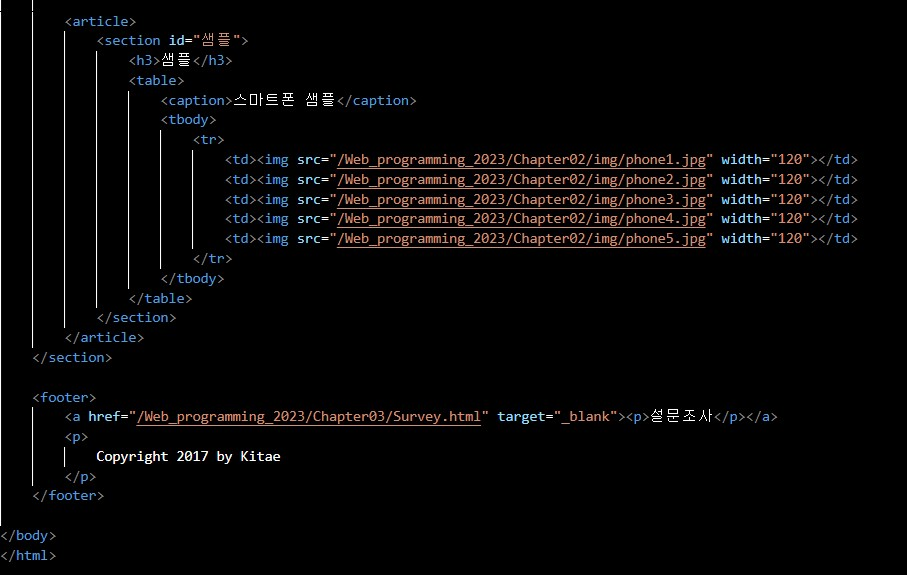

코드

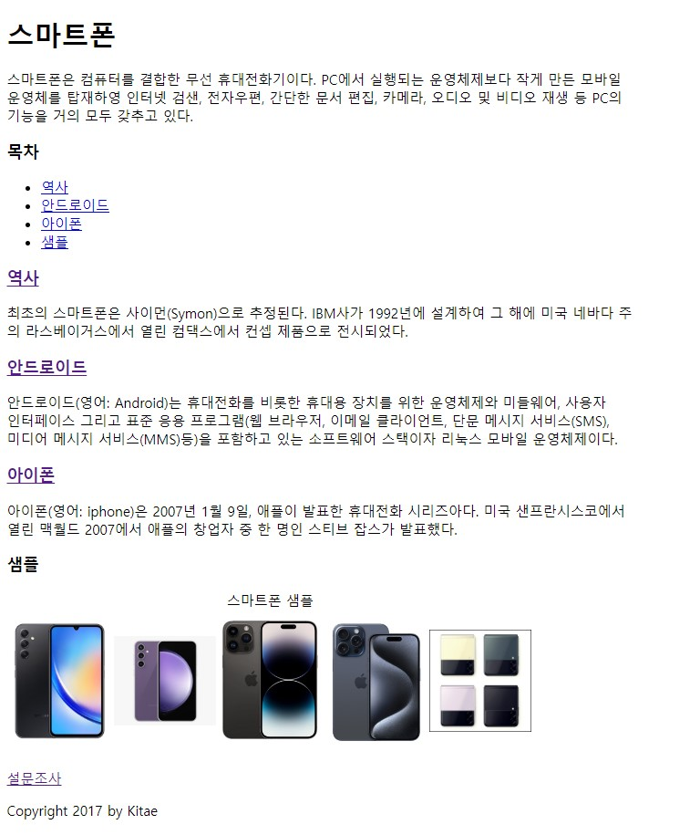

웹 페이지

그리고 설문조사 페이지를 추가했다.
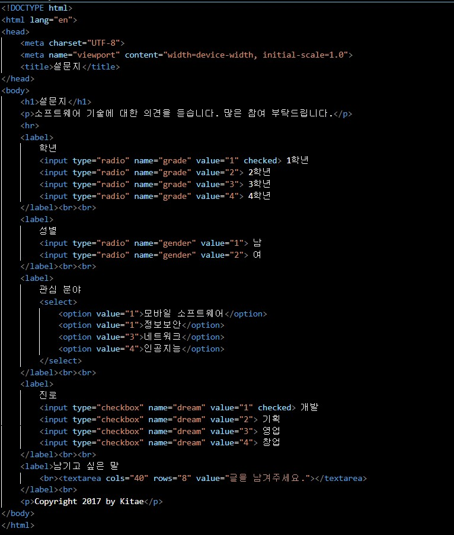

코드

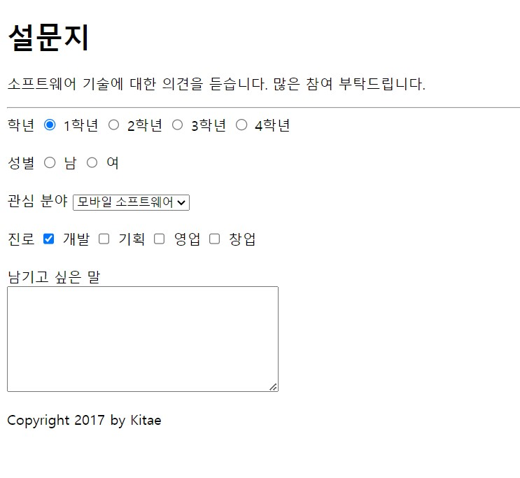

웹 페이지

# 실습문제 1번
<h2>버튼을 가진 웹 페이지 작성하기</h2>
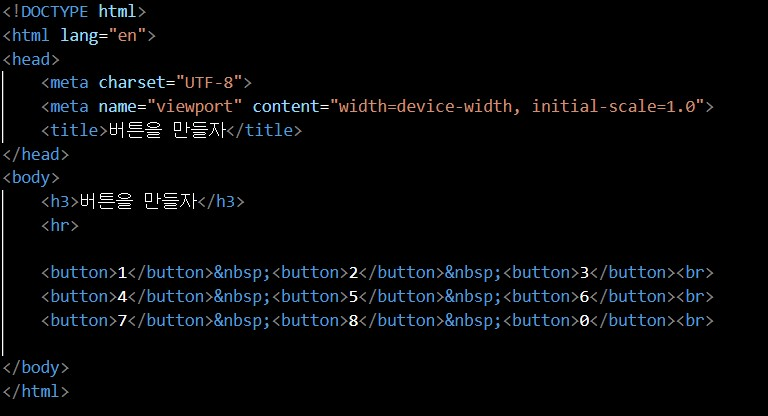

코드

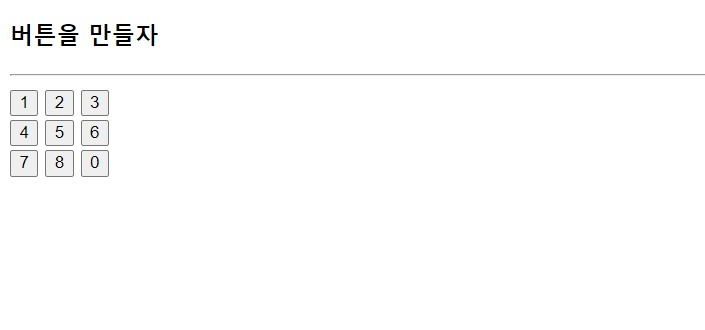

웹 페이지

# 실습문제 2번
<h2>&lt;figure&gt; 태그와 &lt;figcaption&gt; 태그를 이용하여 문서 작성하기</h2>
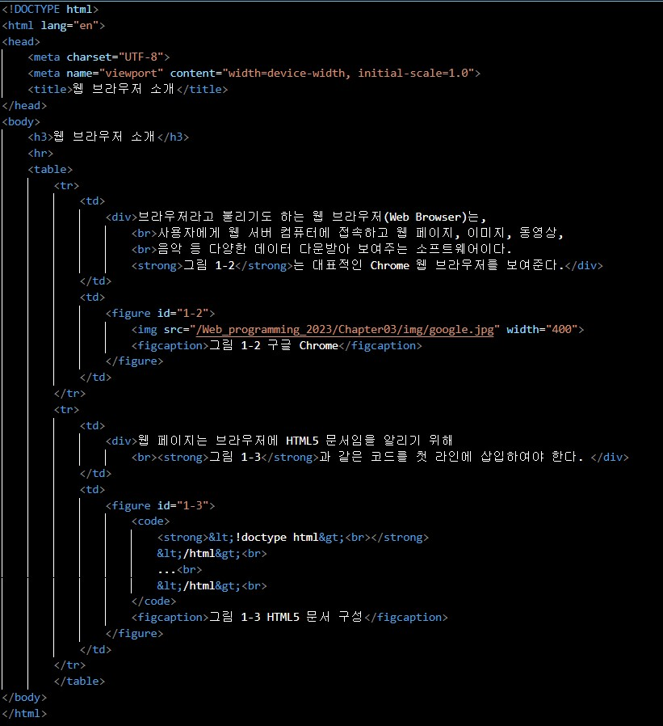

코드

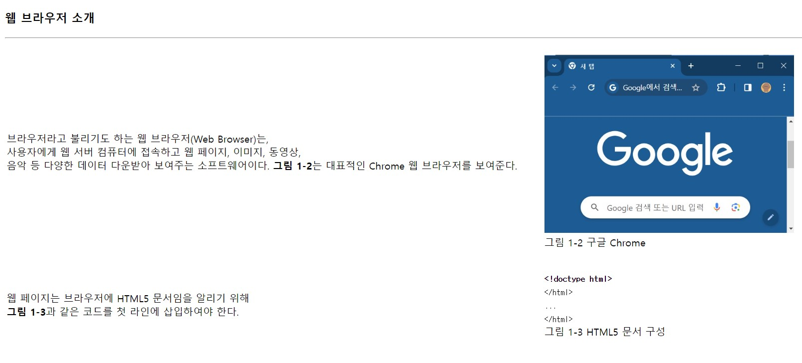

웹 페이지

# 실습문제 3번
<h2>&lt;fieldset&gt;, &lt;legend&gt;, &lt;label&gt;, &lt;input&gt; 태그를 이용하여 폼 작성하기</h2>
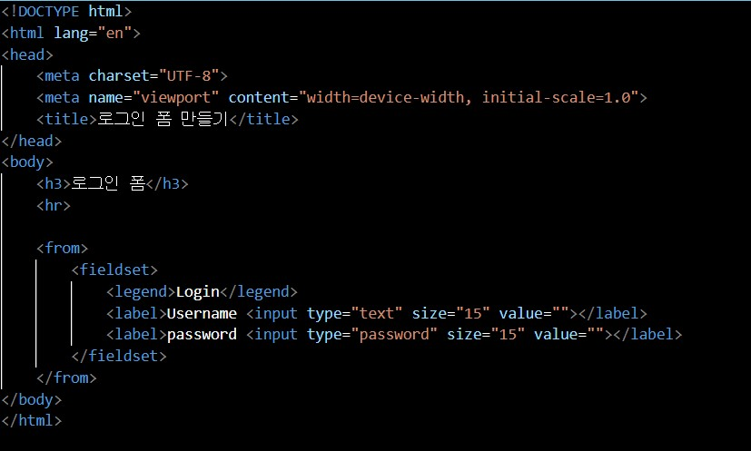

코드

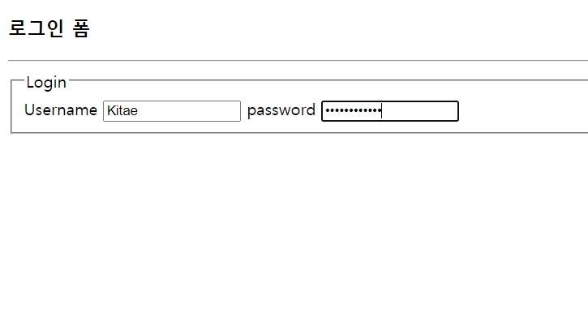

웹 페이지

# 실습문제 4번
<h2>&lt;details&gt;태그와 &lt;summary&gt; 태그를 이용하여 웹 페이지 작성하기</h2>
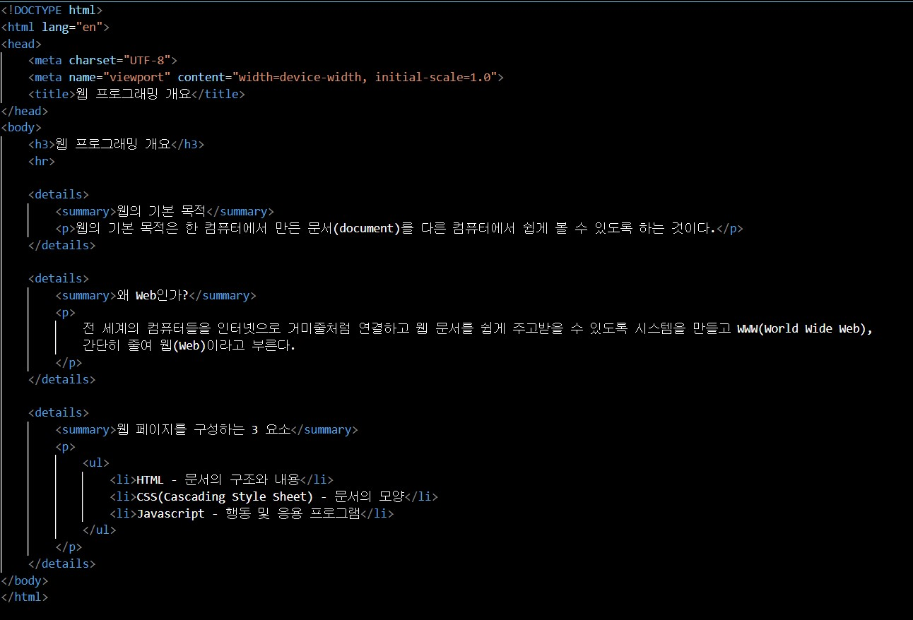

코드

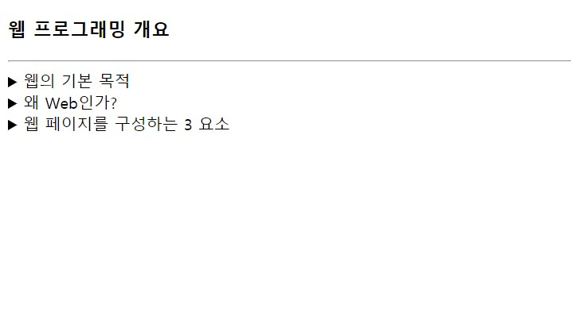

웹 페이지

핸들을 클릭하면 펼쳐지는 것을 확인할 수 있다.

# 실습문제 5번
<h2>도형 서식을 지정하는 폼 작성하기</h2>
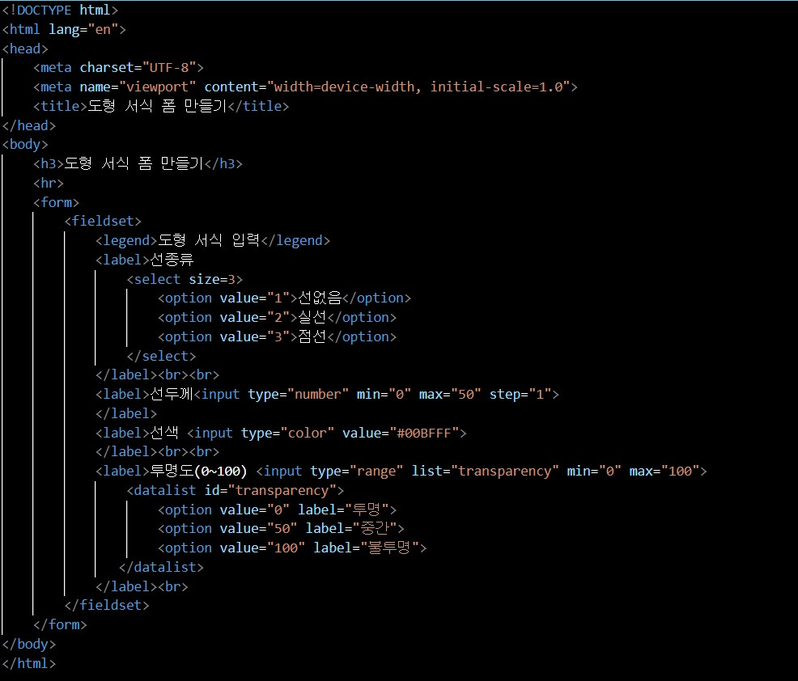

코드

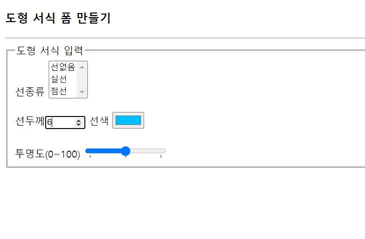

웹 페이지

