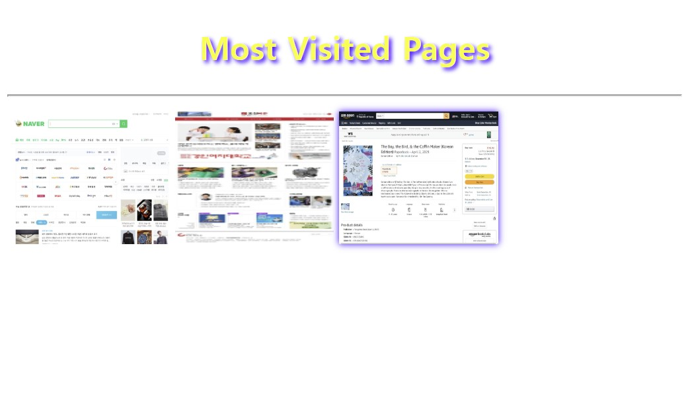

## 문제 풀이

# Open Challenge
<h2>웹 페이지를 CSS를 이용하여 꾸미기</h2>
Chapter 03의 구조화 웹 페이지를 CSS를 이용하여 꾸민 것이다.

코드

웹 페이지

그리고 설문조사 페이지도 CSS를 이용하여 꾸몄다.

코드

웹 페이지

# 실습문제 1번
<h2>태그 이름 셀렉터로 스타일 시트를 삽입하여 브라우저 출력하기</h2>

코드

웹 페이지

# 실습문제 2번
<h2>태그 이름 셀렉터로 스타일 시트를 삽입하여 브라우저 출력하기</h2>

코드

웹 페이지

# 실습문제 3번
<h2>색 이름, 색 코드, 색을 보여주는 테이블 작성하기</h2>

코드

웹 페이지

# 실습문제 4번
<h2>셀렉터와 스타일 시트를 삽입하여 브라우저 출력하기</h2>

코드

웹 페이지

# 실습문제 5번
<h2>셀렉터와 스타일 시트를 삽입하여 브라우저 출력하기</h2>

코드

웹 페이지

# 실습문제 6번
<h2>밑줄없는 초록색 링크를 만들고 마우스가 올라가면 색깔이 바뀌는 HTML 페이지 작성하기</h2>

코드

웹 페이지

마우스가 링크 위에 올라가면 violet색으로 바뀌는 것을 볼 수 있다.

# 실습문제 7번
<h2>&lt;div&gt; 태그를 이용해 카드 뒷면을 출력하고 마우스를 올리면 카드 앞면이 보이는 HTML 페이지 작성하기</h2>

코드

웹 페이지

마우스를 카드 위에 올리면 카드의 앞면이 보이는 것을 볼 수 있다.

# 실습문제 8번
<h2>&lt;img&gt; 태그로 이미지를 출력하고 액자 모양의 이미지 테두리 만들기</h2>

코드

웹 페이지

# 실습문제 9번
<h2>페이지 작성하기</h2>

코드

웹 페이지

마우스를 올리면 박스 그림자가 생기는 것을 볼 수 있다.
