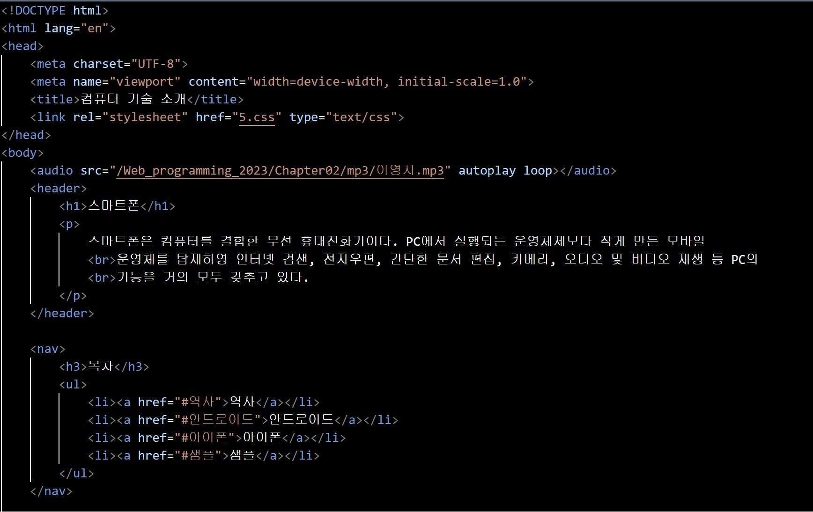
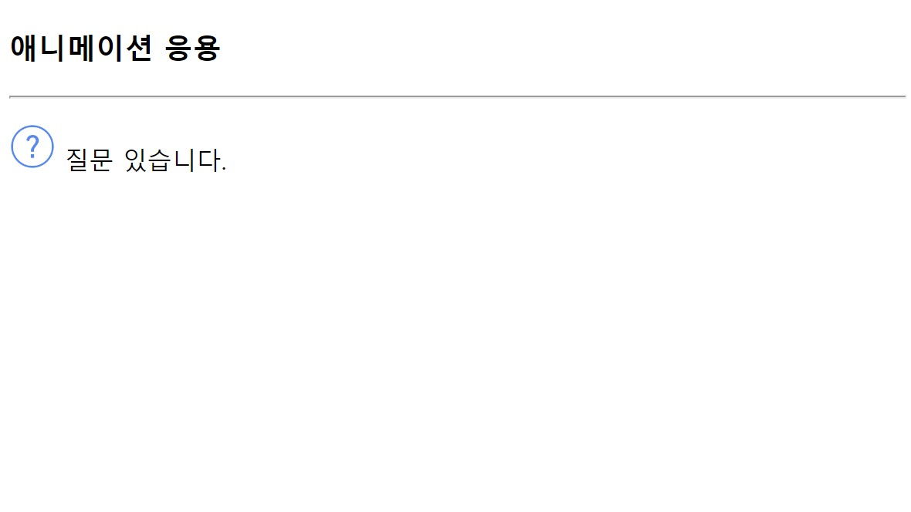

## 문제 풀이

# Open Challenge
<h2>웹 페이지를 CSS를 이용하여 꾸미기</h2>
Chapter 04의 웹사이트를 수정한 것이다.

코드

웹 페이지

그리고 설문조사 웹페이지도 똑같이 수정하였다.

코드

웹 페이지

# 실습문제 1.(1)번
<h2>display 프로퍼티 이용하기</h2>

코드

웹 페이지

# 실습문제 1.(2)번
<h2>display 프로퍼티 이용하기</h2>

코드

웹 페이지

# 실습문제 2번
<h2>position:fixed를 이용하여 광고문 작성하기</h2>

코드

웹 페이지

# 실습문제 3번
<h2>HTML 태그와 CSS3을 이용하여 오디오 재생 리스트를 표로 작성하기</h2>

코드

웹 페이지

# 실습문제 4.(1)번
<h2>리스트와 CSS3 스타일 시트를 이용하여 페이지 작성하기</h2>

코드

웹 페이지

# 실습문제 4.(2)번
<h2>리스트와 CSS3 스타일 시트를 이용하여 페이지 작성하기</h2>

코드

웹 페이지

# 실습문제 5번
<h2>이미지를 넣고 웹 페이지 작성하기</h2>

코드

웹 페이지

# 실습문제 6.(1)번
<h2>1초에 한 바퀴씩 무한번 반복하는 애니메이션 작성하기</h2>

코드

웹 페이지

# 실습문제 6.(2)번
<h2>왼쪽으로 90도 갔다가 다시 오른쪽으로 90도 가기를 1초에 1번씩 무한 반복하는 애니메이션 작성하기</h2>

코드

웹 페이지

# 실습문제 7번
<h2>이미지의 폭이 늘어나는 애니메이션 작성하기</h2>

코드

웹 페이지

# 실습문제 8번
<h2>상하로 출력되는 메뉴 만들기</h2>

코드

웹 페이지

# 실습문제 9번
<h2>'카푸치노를 만드는 과정'을 웹 페이지로 만들기</h2>

코드

웹 페이지

# 실습문제 10번
<h2>3초에 걸쳐 슬라이딩이 되는 애니메이션 작성하기</h2>

코드

웹 페이지

