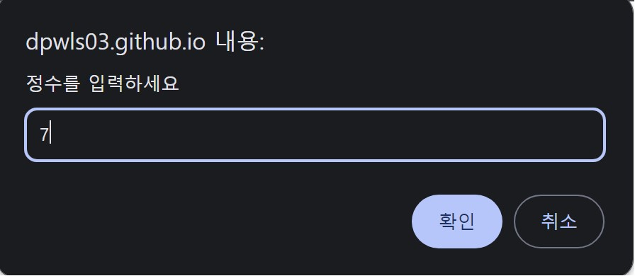
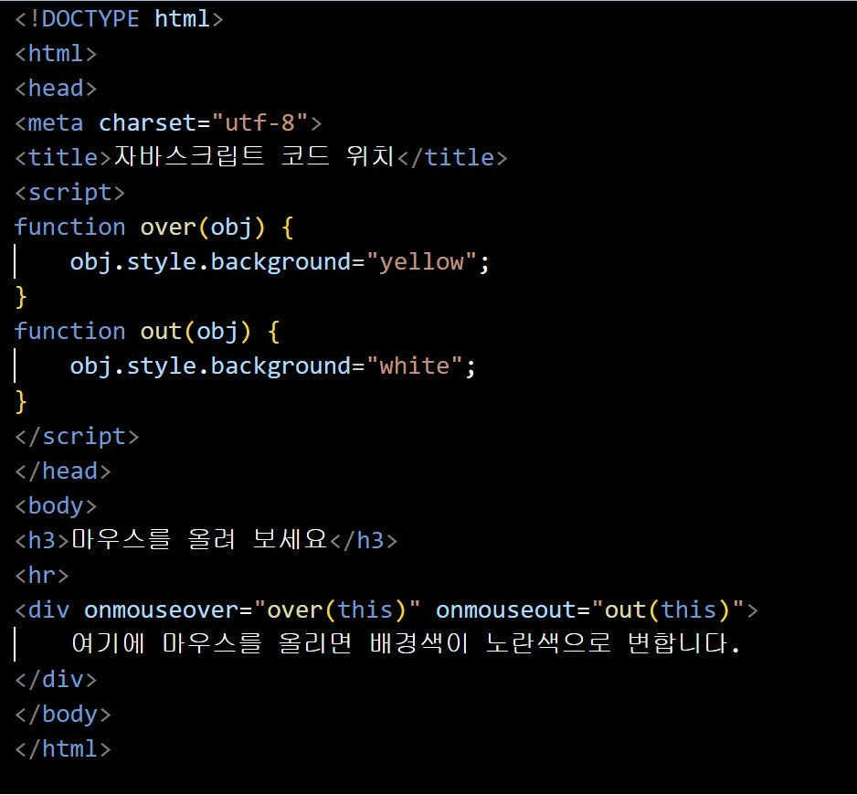
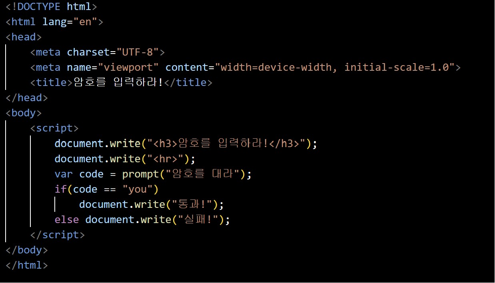

## 문제 풀이

# Open Challenge
<h2>별문자(*) 출력하기</h2>

코드

웹 페이지

양의 정수가 아닌 문자열을 입력하면 입력 오류라는 문구가 출력되는 것을 볼 수 있다. 

# 실습문제 1.(1)번
<h2>자바스크립트 코드를 &lt;script&gt; 태그에 삽입하기</h2>

코드

웹 페이지

# 실습문제 1.(2)번
<h2>자바스크립트 코드를 6-1.js 파일에 저장해서 &lt;script&gt; 태그로 파일 불러오기</h2>

js 파일

코드

웹 페이지

# 실습문제 2번
<h2>document.write()를 이용해서 자바스크립트 코드 완성하기</h2>

코드

웹 페이지

# 실습문제 3.(1)번
<h2>document.write()를 이용해서 자바스크립트 코드 완성하기</h2>

코드

웹 페이지

# 실습문제 3.(2)번
<h2>document.write()를 이용해서 자바스크립트 코드 완성하기</h2>

코드

웹 페이지

# 실습문제 4번
<h2>prompt() 함수를 이용하여 '출근', '휴일'을 출력하는 자바스크립트 코드 작성하기</h2>

코드

웹 페이지

# 실습문제 5번
<h2>정확한 암호가 입력될 때까지 prompt()를 출력하는 자바스크립트 코드 작성하기</h2>

코드

웹 페이지

# 실습문제 6.(1)번
<h2>&lt;script&gt; 태그 내에 함수 작성하기</h2>

코드

웹 페이지

# 실습문제 6.(2)번
<h2>&lt;script&gt; 태그 내에 함수 작성하기</h2>

코드

웹 페이지

# 실습문제 7번
<h2>prompt() 함수로 큰 자리수와 낮은 자리수가 같은지 비교하여 '같음', '다름'을 출력하기</h2>

코드

웹 페이지

# 실습문제 8번
<h2>prompt() 함수로 수식을 입력받아 계산 결과 출력하기</h2>

코드

웹 페이지

