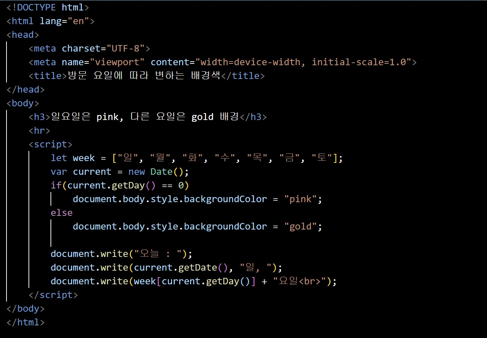
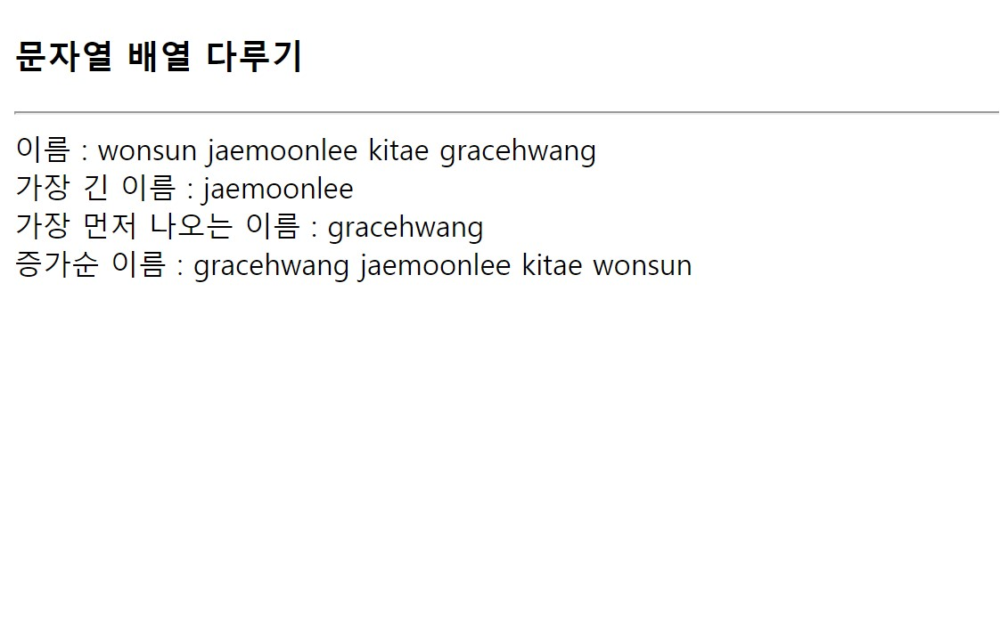
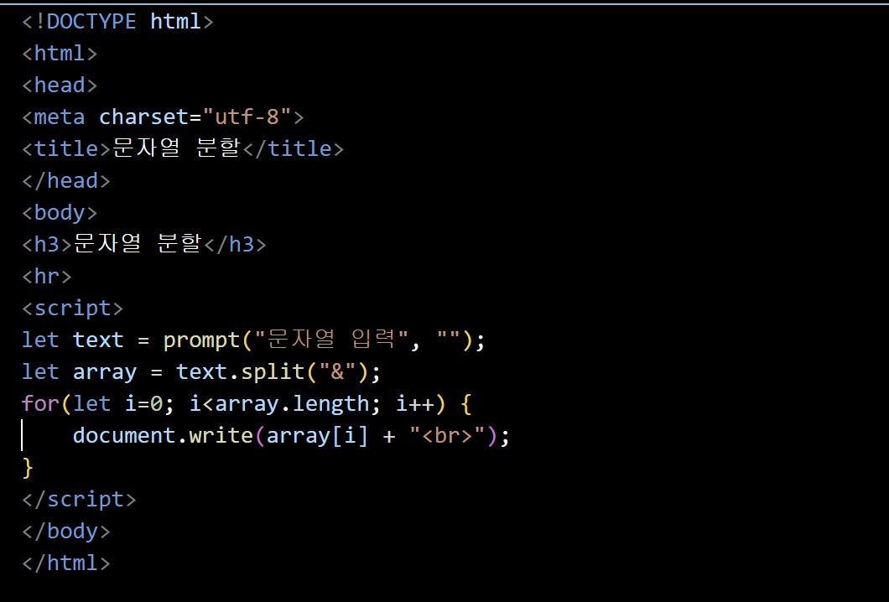

## 문제 풀이

# Open Challenge
<h2>배열을 리스트의 아이템으로 출력하기</h2>

코드

웹 페이지

# 실습문제 1번
<h2>배열에 저장된 수 중 가장 큰 수 출력하기</h2>

코드

웹 페이지

# 실습문제 2번
<h2>5개의 정수를 입력받아 배열에 저장하고 입력된 반대 순으로 출력하기</h2>

코드

웹 페이지

# 실습문제 3번
<h2>오전이면 배경색을 lightskyblue로, 오후이면 orange로 출력하기</h2>

코드

오전이라서 배경색이 lightskyblue로 출력된 것을 볼 수 있다.

오후라서 배경색이 orange로 출력된 것을 볼 수 있다.

웹 페이지

# 실습문제 4번
<h2>월요일 ~ 토요일이면 배경색을 gold로, 일요일이면 pink로 출력하기</h2>

코드

월요일 ~ 토요일이라서 배경색이 gold로 출력된 것을 볼 수 있다.

일요일이라서 배경색이 pink로 출력된 것을 볼 수 있다.

웹 페이지

# 실습문제 5번
<h2>배열 names를 가지고 자바스크립트 코드를 작성하기</h2>

코드

웹 페이지

# 실습문제 6번
<h2>prompt() 함수를 호출하여 문자열을 입력받고 "&" 문자를 기준으로 분할하여 출력하기</h2>

코드

웹 페이지

# 실습문제 7번
<h2>색 이름 문자열 배열 colorNames를 만들고 문자열을 &lt;div&gt; 태그로 출력하기</h2>

코드

웹 페이지

# 실습문제 8번
<h2>document.write()를 이용하여 16개의 &lt;div&gt; 태그로 출력하고 배경색을 랜덤한 색으로 칠하는 웹페이지 작성하기</h2>

코드

웹 페이지

# 실습문제 9.(1)번
<h2>new Object()를 이용하여 book 객체를 작성하고 객체를 출력하기</h2>

코드

웹 페이지

# 실습문제 9.(2)번
<h2>리터털 표기법으로 book 객체를 작성하고 객체를 출력하기</h2>

코드

웹 페이지

# 실습문제 9.(3)번
<h2>프로토타입 Book을 작성하고 book 객체를 출력하기</h2>

코드

웹 페이지

# 실습문제 10번
<h2>new Object()를 이용하여 생성한 book 객체를 이용해 prompt() 함수를 통해 5개의 책 정보를 입력받고 가장 비싼 책 이름을 출력하기</h2>

코드

웹 페이지
